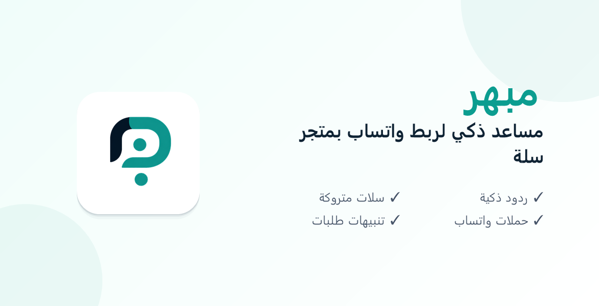

# تقرير تجهيز وتعديل الأصول البصرية لتطبيق سلة (Salla Assets Report) - الإصدار الخامس النهائي

تم إعادة إنتاج جميع الأصول البصرية لتطبيق **مبهر** باستخدام **الأيقونة الشفافة عالية الدقة (`1024x1024` بكسل)** كمصدر وحيد وأساسي، مما أدى إلى تحقيق حدة مثالية والتخلص الكامل من أي بكسلة أو حواف رمادية قديمة.

---

## 1. تفاصيل الملفات النهائية المعتمدة

### 1. أيقونة التطبيق الرسمية بخلفية بيضاء دائرية (`salla_app_icon_512.png`) [RECREATED]
* **الأبعاد:** `512x512` بكسل.
* **الحجم:** `52.69 KB` (53,959 bytes).
* **طريقة العمل:**
  * تم إنتاجها بالكامل باستخدام الرمز الشفاف عالي الدقة كمصدر.
  * تم رسم بطاقة بيضاء دائرية ناعمة (Card) بزوايا دائرية نصف قطرها `90` بكسل وظل ناعم متعدد الطبقات (Multi-layered Shadow).
  * تم دمج الرمز الشفاف في المنتصف بدقة فائقة وبأعلى جودة وحدة، دون استخدام الصورة القديمة المنخفضة الجودة.

### 2. غلاف التطبيق المعتمد (`salla_app_cover_1170x600.png`) [RECREATED]
* **الأبعاد:** `1170x600` بكسل.
* **الحجم:** `52.46 KB` (53,717 bytes).
* **طريقة العمل:**
  * تم استخدام الرمز الشفاف عالي الدقة كمصدر وحيد للشعار على الغلاف.
  * تم دمج الشعار الشفاف فوق بطاقة بيضاء نظيفة تماماً وبزوايا دائرية ناعمة مع ظل خفيف، لتظهر كعنصر عائم دون أي حدود أو فواصل رمادية.
  * تم المحافظة على التدرج اللوني الهادئ للخلفية والخط العربي الأنيق (`Segoe UI`) مع قائمة الميزات والالتزام بضوابط سلة.

### 3. أيقونة التطبيق بخلفية شفافة (`salla_app_icon_512_transparent.png`)
* **الأبعاد:** `512x512` بكسل.
* **الحجم:** `43.56 KB` (44,607 bytes).
* **حالة الملف:** مستخدم كمصدر أساسي ومحفوظ للتصاميم والصفحة الرئيسية.

---

## 2. معاينة الأصول المعتمدة (Preview)

> [!NOTE]
> الصور أدناه هي المعاينة الفعلية للملفات المحدثة في مجلد الأصول.

### أيقونة التطبيق الرسمية الجديدة (512x512)


---

### غلاف التطبيق المحسّن الجديد (1170x600)


---

### أيقونة التطبيق الشفافة عالية الدقة (512x512)


---

## 3. نتيجة فحص `git status`

تم فحص حالة المشروع والملفات المتبعة محلياً:

```text
On branch main
Your branch is ahead of 'origin/main' by 1 commit.
  (use "git push" to publish your local commits)

Changes not staged for commit:
  (use "git add <file>..." to update what will be committed)
  (use "git restore <file>..." to discard changes in working directory)
	modified:   public/salla-assets/salla_app_cover_1170x600.png
	modified:   public/salla-assets/salla_app_icon_512.png
	modified:   salla_assets_report.md

Untracked files:
  (use "git add <file>..." to include in what will be committed)
	scratch/

no changes added to commit (use "git add" and/or "git commit -a")
```

> [!IMPORTANT]
> تم تعديل الملفات المطلوبة بنجاح وهي جاهزة لدمجها وعمل الـ `amend` النهائي لتكون جميعاً ضمن الـ Commit الوحيد المعتمد محلياً للأصول.
